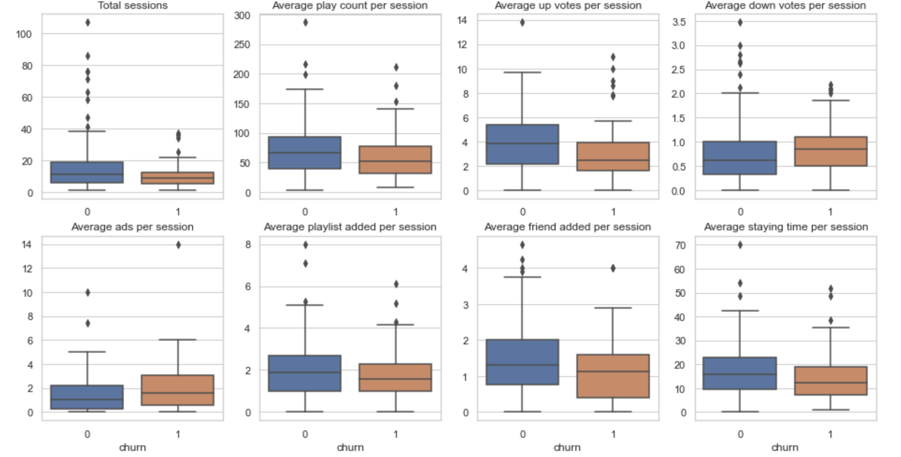

## Project Overview
It is essential for subscription service provider to predict in advance which user group will likely churn. 
Sparkify is a fictional music streaming service which provides a free version that includes advertisements and a paid version that pays a fixed amount every month. 
Users can create their playlists, and add friends to communicate with. 
As users use the service, every event is recorded, such as listening to music, adding friends, downgrading/upgrading, upvoting, and also canceling subscriptions. 
We can use these logs along with users’ demographic data to build a model that predicts what type of users will churn.

Large datasets are loaded into Spark, and manipulated using Spark SQL and Spark Dataframes. Then, Prediction models are built and tuned using Spark ML APIs. 

## installations
- Python3
- pyspark
- pandas
- seaborn
## Project Description
1. Load and Clean Dataset
2. Exploratory Data Analysis
3. Feature Engineering
4. Modeling
5. Results
 

## File Descriptions
- Sparkify.ipynb: It contains all code for data cleaning, preprocessing, EDA, feature engineering, modeling and evaluating. 
- dataset: mini, medium and large datasets(only on AWS public) are available.

## Licensing, Authors, Acknowledgements
The data is provided by Udacity.

https://github.com/stillqe/sparkify.git
